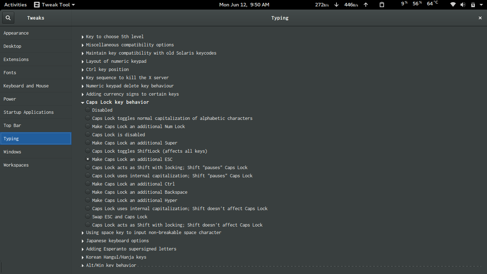

Switch Caps to Esc from terminal

```shell
setxkbmap -option caps:escape
```

For swapping Caps with Esc

```shell
setxkbmap -option caps:swapescape
```

On Linux Gnome desktops you can do easily with Tweak Tool

######If you want to use Caps Lock
_Tweak Tool > Typing > Caps Lock key behavior > Swap ESC and Caps Lock_

OR

######If you want Caps Lock and Esc key as the same key

_Tweak Tool > Typing > Caps Lock key behavior > Make Caps Lock an additional ESC_

##### For Ubuntu unity

```shell
sudo apt-get install dconf-tools
```

After starting the dconf-editor, navigate to org >> gnome >> desktop >> input-sources.

Add 'caps:swapescape' in xkb-options []

######For visual studio code, vim plugin add in your _keybindings.json_
File > Preferences > Keyboard Shortcuts and click on the link keybindings.json

```json
// Place your key bindings in this file to overwrite the defaults
[
  {
    "key": "capslock",
    "command": "extension.vim_escape",
    "when": "editorTextFocus && vim.active && !inDebugRepl"
  }
]
```
