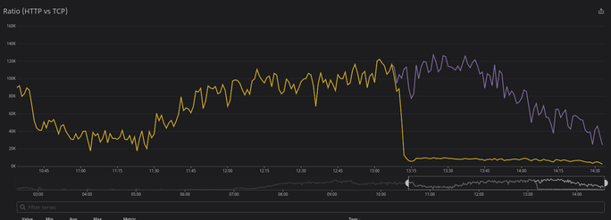
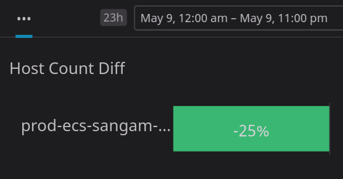
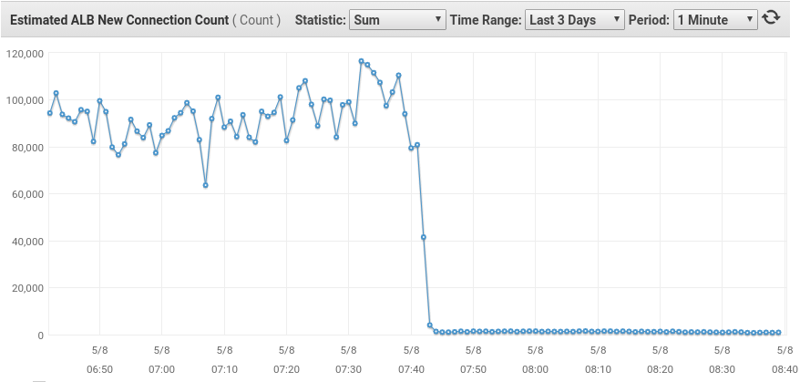

All communication between microservices occurs via an HTTP request.

To make a single HTTP request, services perform the following steps:

1. Perform a DNS query to get the IP address.
2. Create a TCP connection with the IP.
3. Perform the HTTP request.

This process creates a lot of overhead and redundancy because a new TCP connection is established before each request. This is especially problematic for services that make many outgoing HTTP requests. We can avoid the first two steps by reusing TCP connections instead of performing the expensive TCP 3-way handshake and DNS query resolution.

## What is the solution?

Enabling HTTP keep-alive allows us to reuse existing connections.

However, services built with Node.js have a problem because Node's HTTP library does not, by default, use Keep-Alive connections. At peak hours, we observed that one of our services made around 200k requests per minute to our downstream services.

Node.js allows us to create a custom agent for making HTTP requests. Therefore, we can create a new agent with the keepAlive flag turned on.

<div class="filename">native-http.js</div>

```javascript
import http from "http"
import https from "https"

const httpAgent = new http.Agent({ keepAlive: true })

const options = {
  hostname: "www.google.com",
  path: "/",
  agent: httpAgent,
}

const req = http.request(options, (res) => {
    res.on('data', (chunk ) => {
      ...
    })
})
```

<div class="filename">axios.js</div>

```javascript
import http from "http"
import https from "https"
import axios from "axios"

const httpAgent = new http.Agent({ keepAlive: true })
const httpsAgent = new https.Agent({ keepAlive: true })

const api = axios.create({
  baseURL: "http://google.com",
  httpAgent,
  httpsAgent,
})

export default api
```

## Benefits of using HTTP keep-alive

- We observed almost a 25% reduction in the number of containers required to handle the same workload.
- We significantly reduced TCP connections and DNS queries.
- We reduced the number of new connections in the ELB of downstream services.
- We eased the strain on our DNS service and avoided hitting AWS DNS limits.








</div>
