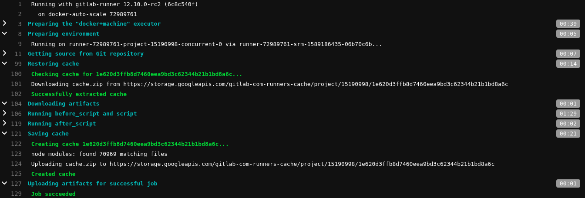

Gitlab CI/CD provides a mechanism to cache project dependency so that it can be reused and shared between pipelines and jobs.
Using cache decreases the time spent on each job. The cache can be enabled by using `cache:` keyword in your `.gitlab-ci.yml` file. It also allows for providing a `cache:key` directive for each cache.
Different strategies can be used for generating cache keys.

e.g:  Using [ predefined variables ](https://docs.gitlab.com/ee/ci/variables/predefined_variables.html) like `$CI_COMMIT_REF_SLUG` to create separate cache for each branch.

But projects using npm have their lock file for managing dependency which can be used to create a cache key. The cache will only be updated when the lock file is changed. By adding `cache:key` directive the key is saved as the SHA checksum of the lock file, therefore key will only change when the lock file is updated. Even if there are many branches in your project unless the packages are updated or new one are added they can all share the same cache.

Here is the example of using package-lock.json as a cache key which is generated automatically when you install any packages.

<div class="filename">.gitlab-ci.yml</div>

```yaml
stages:
  - ci

.cache: &cache
  cache:
    key:
      files:
        - package-lock.json
    paths:
      - node_modules

lint:
  stage: ci
  image: node:12.14.1
  <<: *cache
  script:
    - npm install
    - npm run lint

test:
  stage: ci
  image: node:12.14.1
  <<: *cache
  script:
    - npm install
    - npm run test
```

If your project uses yarn this you can change to use `yarn.lock` as key

<div class="filename">.gitlab-ci.yml</div>

```yaml
stages:
  - ci

.cache: &cache
  cache:
    key:
      files:
        - yarn.lock
    paths:
      - node_modules

lint:
  stage: ci
  image: node:12.14.1
  <<: *cache
  script:
    - yarn
    - yarn lint

test:
  stage: ci
  image: node:12.14.1
  <<: *cache
  script:
    - yarn
    - yarn test
```

Now gitlab will save and reuse the content of the cache on each subsequent jobs.



Reference:

- [ Gitlab CI/CD Cache Key ](https://docs.gitlab.com/ee/ci/yaml/#cachekeyfiles)
